# Creating Audio Clips in Unity

To manage audio clips for each audio in the game, we use a script called `AudioCueSO.cs`. Follow these steps to create a new audio cue:

1. Navigate to the directory `Assets\ScriptableObjects\Audio\Data\...`.

2. To create a new cue, right-click in the project space.

3. Click on **Create** in the top menu.

4. Go to `Crypto Quest` > `Audio` > `Audio Cue`.

5. Rename the audio according to the naming convention. [[Tutorials]](#audio-naming)

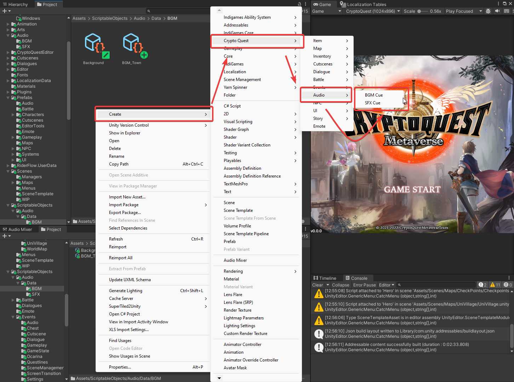

---
@icon-gear Configuration
---

Use the following table to configure the audio:
+--------------------+--------------------+
|    For BGM         |      For SFX       |
|--------------------|--------------------|
| > Always check     | > Do not check loop|
| > loop for the BGM | > for the SFX      |
+====================+====================+

### BGM Cue

Example setup for Background Music (BGM):
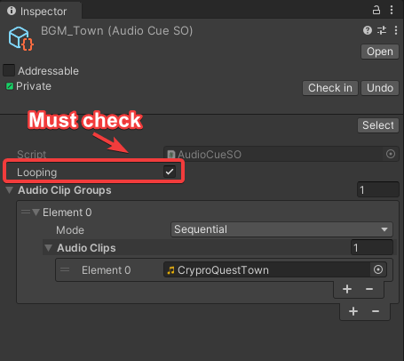

### SFX Cue

Example setup for Sound Effects (SFX):
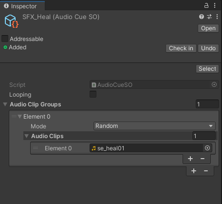

# Audio Naming

Use underscores `_` to replace the word `for`. For example:
- SFX for Heal => SFX_Heal
- BGM for Town => BGM_Town

## Setting up BGM and SFX :musical_note: :dizzy:

### BGM Setup:

To set up Background Music (BGM), follow these steps:

1. Locate the script named `PlayMusicOnSceneLoaded.cs`, responsible for playing audio when a scene is loaded.

2. To access `PlayBGMWhenSceneLoaded`, go to `Assets\Prefabs\Audio\...`
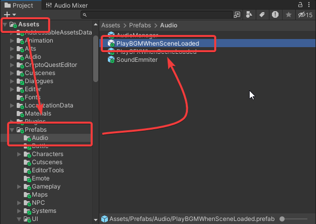

3. Drag the **PlayBGMWhenSceneLoaded** object to the `Hierarchy` (current scene).
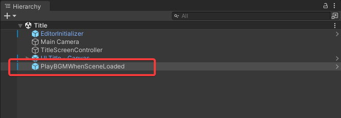

4. In the **Music Track** field, set the audio clip you have created for the BGM.
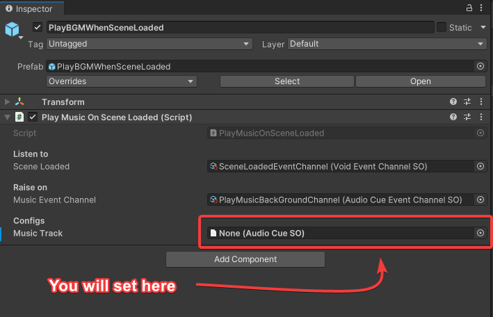
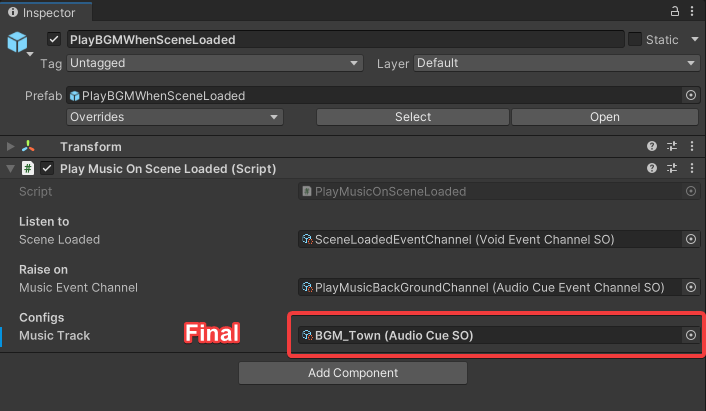

### SFX Setup:

To set up Sound Effects (SFX), follow these steps:

1. Locate the script named `PlaySFX.cs`, responsible for playing audio when a button is clicked or when something makes a sound (e.g., open the door, ring the bell, etc.).

2. To access `PlaySFX`, go to `Assets\Prefabs\Audio\...`
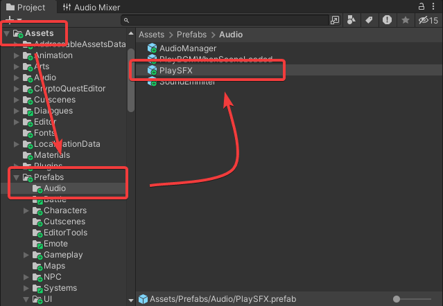

3. Drag the **PlaySFX** object to the `Hierarchy` (current scene).
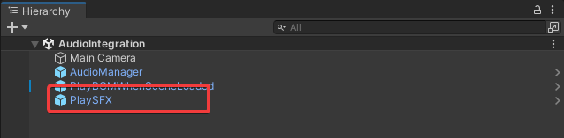

4. In the **PlaySFX** field, set the audio clip you have created for the SFX.
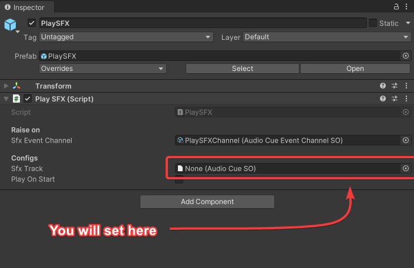
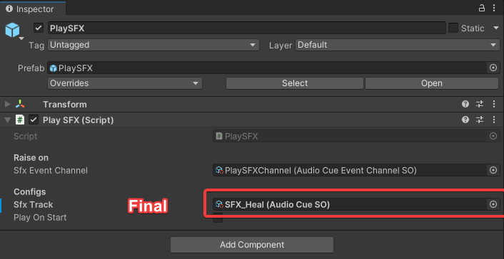

5. For UI, drag the **PlaySFX** object inside a `Button` and set the OnClick event with **OnPlaySFX**.
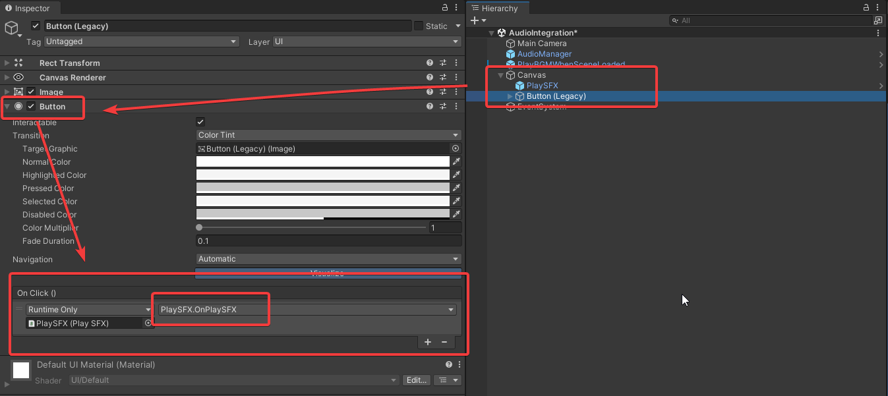

6. (For Developers :computer:) For NPC or player, if you want to custom play SFX:

- Animation: We have `animation events`. Add the script `PlaySFX.cs` to objects or prefabs you have and create a new `animation event` to trigger the sound, similar to using a `Button`.
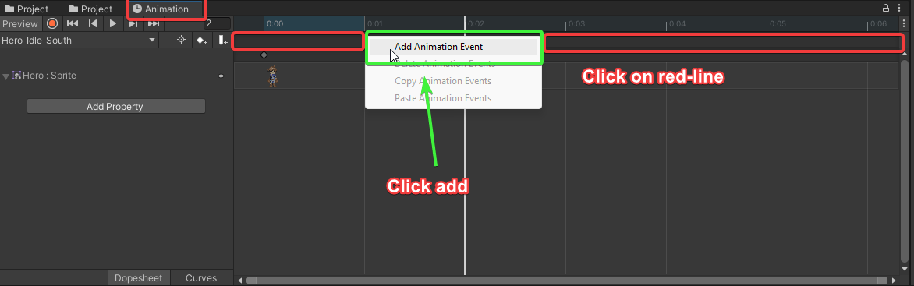
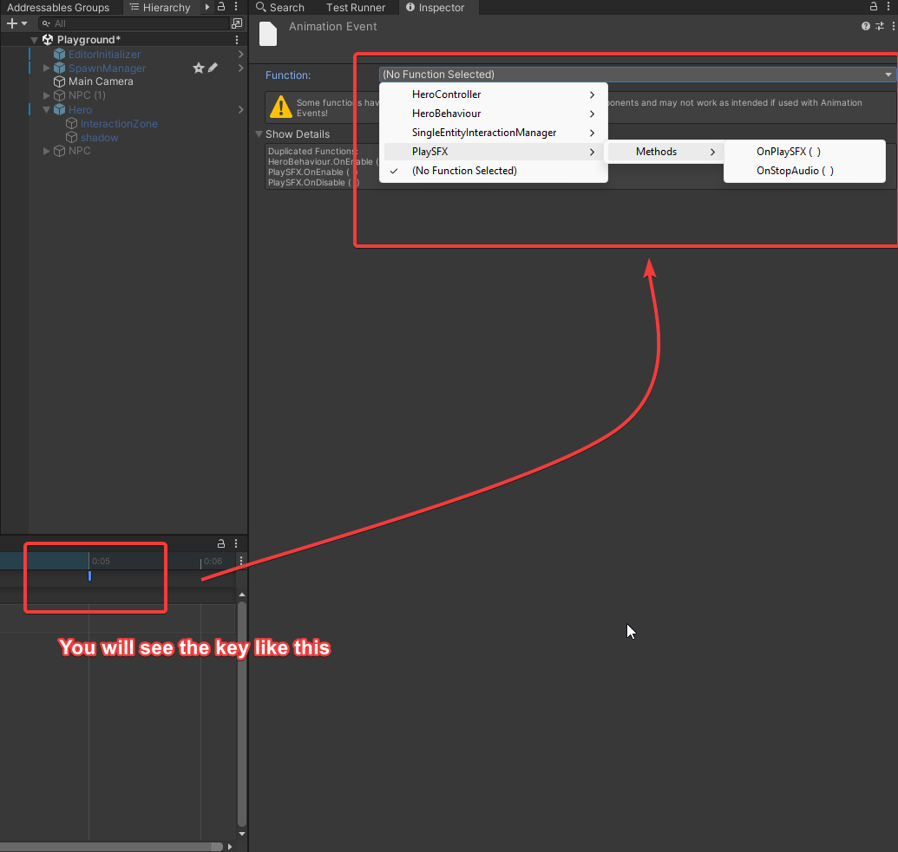

<i class="fa fa-refresh fa-spin fa-2x"></i>  Script: Customize the code depending on your purpose...

# Setting Volume :loud_sound:

The script named `AudioSettingsSO.cs` is responsible for managing all audio volumes in the game. Follow these steps to manage the volume:

1. Navigate to the directory `Assets\ScriptableObjects\Events\Data\Settings\...`

2. Choose `Audio`, where you will see a **Slider** representing the `Audio Volume`, with a maximum value of 1 and a minimum value of 0.
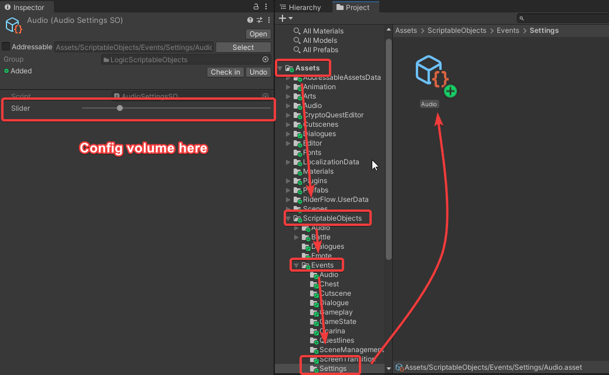

# Audio Manager :building_construction:

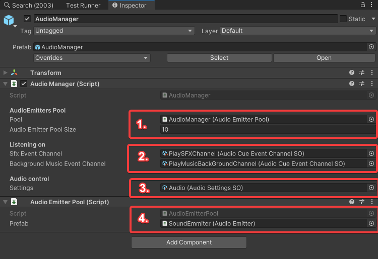

1. **Audio Emitters Pool**: **Audio pooling** is a way to optimize the project and reduce the burden on the CPU when rapidly creating and destroying audio emitters. Configure the default size of the pool here.

2. **Audio Event Listener**: This has main event channels for **PlaySFXChannel** and **PlayBGMChannel** to know what sound needs to be played.

3. **Audio Control Settings**: For setting all audio volumes in the game.

4. **Prefab Audio Emitter**: A must-have to get sound emitters into the pool.
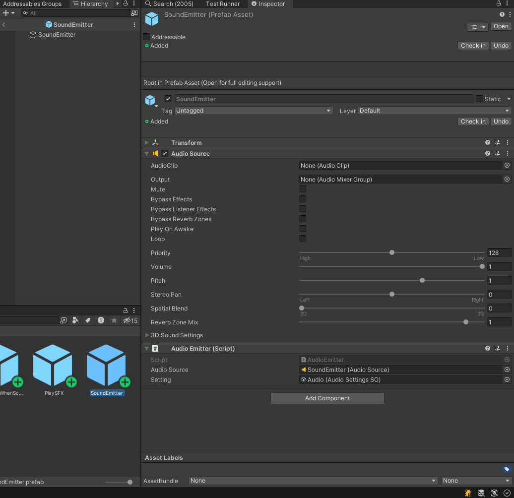
