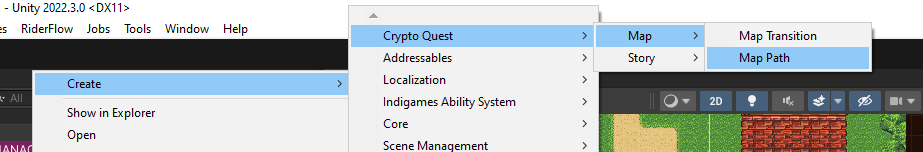
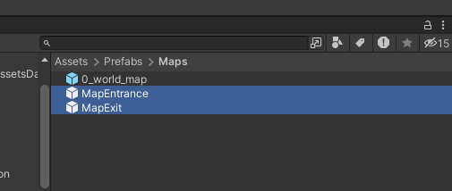
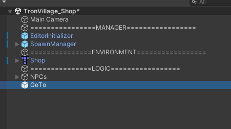
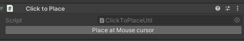
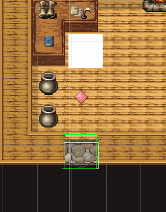
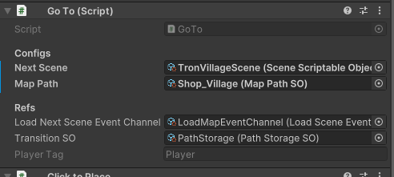
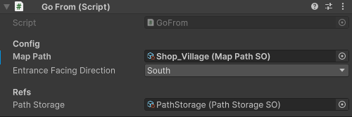
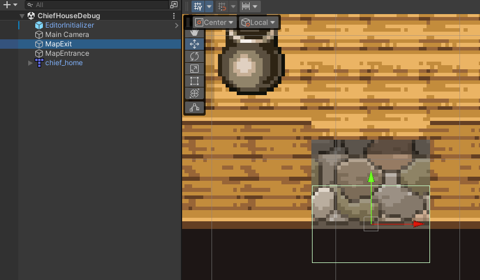
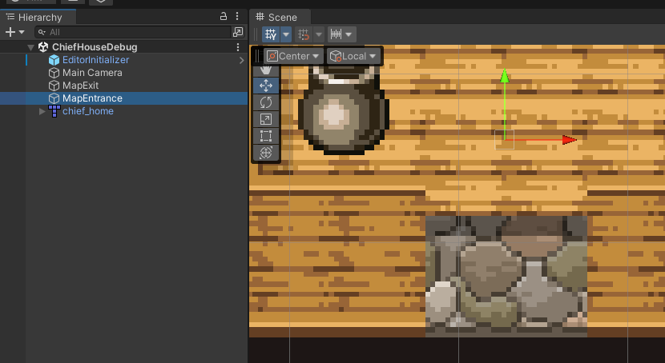

# Create Path

Scriptname: `MapPathSO.cs`

1. Go to `Assets/ScriptableObjects/Paths`.
2. Create new folder with scene name.
3. `Create > CryptoQuest > Map > Map Path`.
     

4. Rename path according to naming convention.

# Path Naming

**Use `_` to replace the world `to`**
Example:

- Castle to World => Castle_World
- Village to Shop => Village_Shop

**Use `.` to replace `of` to specify the location**
Example:

- Village to Floor 1 of Chief House => Village_ChiefHouse.Floor1
- World to North Door of Castle => World_Castle.NorthDoor

**If transit from the same place but a different specified location => Place.Location1_Location2**
Example:

- Floor 1 of Chief House to Floor 2 of Chief House => ChiefHouse.Floor1_Floor2
- Floor 1 of Pulic House to Basement of Pulic House => PulicHouse.Floor1_Basement

# Setup Map Exit and Map Entrance

`GoTo.cs` will handle the transition from the current map to the next map.
`GoFrom` will handle where the player will be placed when entering this current map.

**Set up Go To next map **

1. Navigate to `Assets/Prefabs/Maps`
   
   

2. Drag the `GoTo` prefab to the current map scene

   

3. Select `GoTo` on Hierarchy, in the inspector window, click `Place at Mouse Cursor` and place at desired position.

   

   

4. Choose the Next Scene to transit to
5. Choose Map path to match with the next scene `GoFrom`'s Map path

   

**Set up Map Entrance**

1. Navigate to `Assets/Prefabs/Maps`
2. Drag the `GoFrom` prefab to the current map scene
3. Select `GoFrom` on Hierarchy, in the inspector window, click `Place at Mouse Cursor` and place at desire position.
4. Choose Map path to match with the previous scene `GoTo`'s Map path
5. Select Entrance Facing Direction

   

**Note:
`GoTo` position and `GoFrom` position must be separated by a distance (so that when entering the map, there will be no colliding with `GoTo`'s Collider)**

   

   

