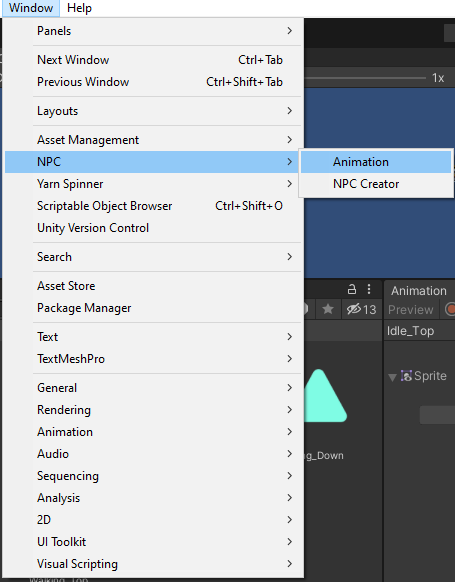
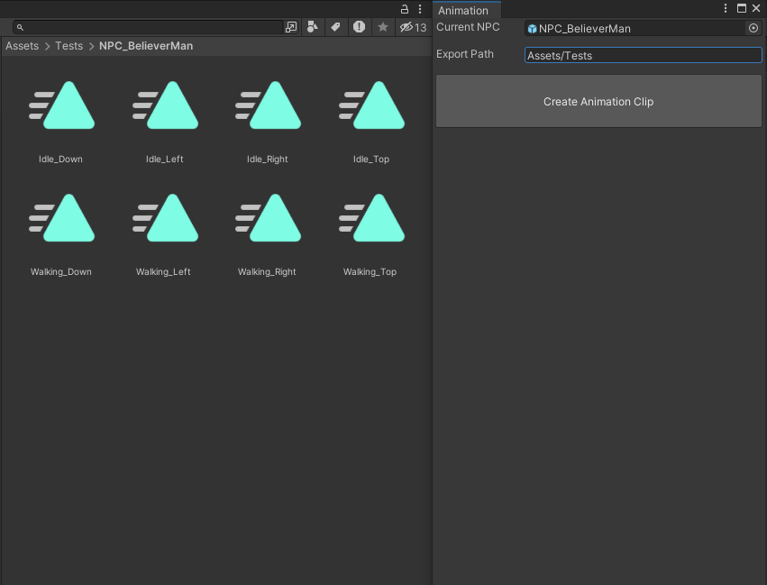
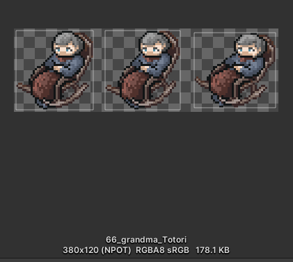
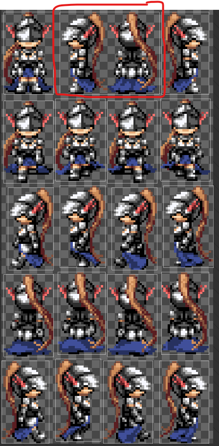
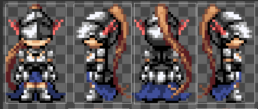

# About this tool
Use this tool to create a set of animation clips using the sprite data.
The animation clips would be created are:
Idle_Down, Idle_Left, Idle_Right, Idle_Top,
Walking_Down, Walking_Left, Walking_Right, Walking_Top
 

# Open NPC Edit tools

1. Click `Window/NPC/NPC Creator` to open Edit tools.

# How to use

### Current NPC
Select Sprite NPC data or prefab NPC data created using NPC Creator.

### Export Path
Select the path where animation clip will be exported.

***Example***

Current NPC: NPC_BelieverMan

Export Path: Assets/Tests

=> `NPC_BelieverMan` folder will be created at Assets/Tests/NPC_BelieverMan

**Note**
- Some NPC Sprite data will not have enough images for creating all the animation clips. 
In this case, you may need to rename animation clip to use it for right purpose.

- Sometime, Images in Sprite data are stick together, which make the Sprite Editor in Unity does not recognize it correctly.
In this case, only 7 animation clip will be created. You need to open Sprite Editor and correct it.

Correct state

