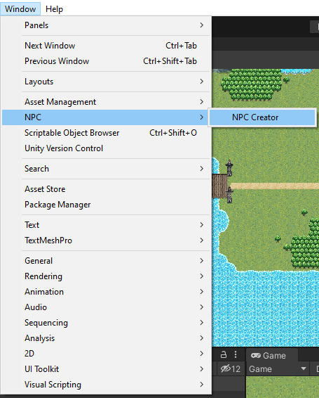
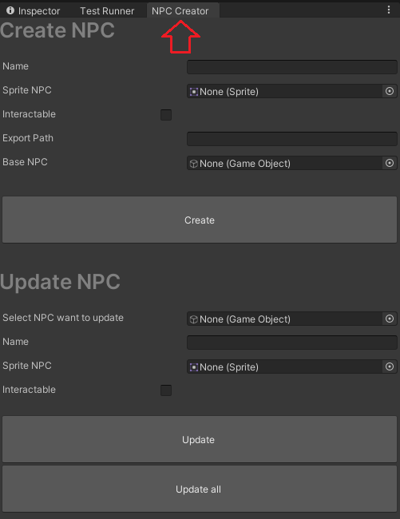
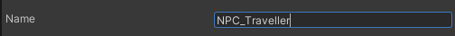
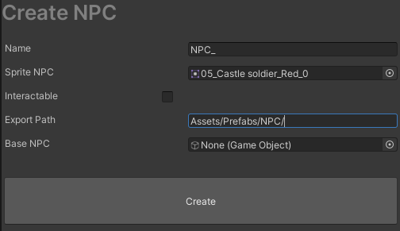
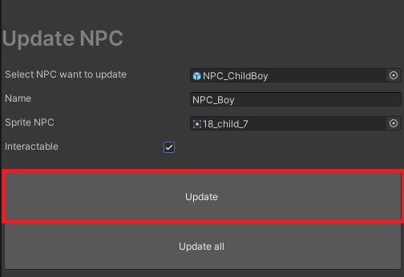
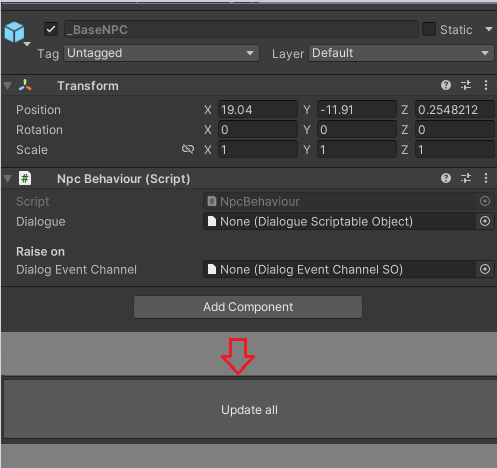
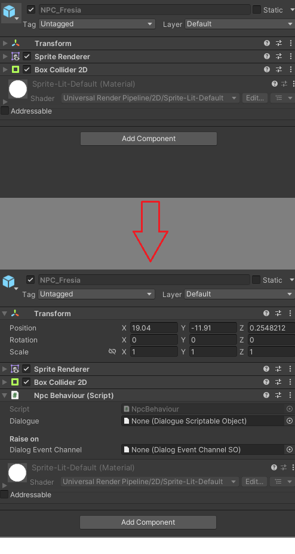

# Open NPC Edit tools

1. Click `Window/NPC/NPC Creator` to open Edit tools.

     

2. Select `NPC Creator` on tools bar to use edit tools

     

# Path Naming

**Use `NPC_` from the start letter to set the name for NPC**
Example:

- NPC_King, NPC_Queen...

> ***Example***
     

**Note:**
- Function `Update All` will be detect all type `Prefab` with name `NPC_` so please input right name syntax.

# How to use

### Create NPC
Input & Setup variables to create NPC:
- Name: Input name for NPC.
- Sprite NPC: Select Sprite import to NPC.
- Interactable: Set collider to NPC so Character can interact with NPC.
- Export Path: The path to export `Prefab` location.
- Base NPC: The `GameObject` will add all components it has to a new NPC Prefab.

>***Example***
     

**Note**
- Interactable: If don't select the checkbox so new `NPC Prefab` will not have Collider so the player can't interact with them. (Example: Fairy, animals,... can't interact with the character and only appear in a cut scene).

## Update NPC
1. Select `NPC Prefab` want to update something like `(Name, Sprite, interactable)` to update `Prefab` want to change.
2. Press `Update` button to update `Prefab` 

***Example***
     

### Update All NPC
- Press `Update All` to update all `Prefabs (NPC)` by GameObject (Base NPC).

***Example***
>- If all NPC Prefabs don't have component `NpcBehaviour.cs`, so press `Update All` will add component `NpcBehaviour.cs` to all Prefabs.

1. Press `Update all` to update all prefabs

     .
2. All `Old Prefabs` don't have `NpcBehaviour.cs` will import `NpcBehaviour.cs` like base GameObject
     .