# Resize tileset in Unit to optimize

Right click on the root folder of the tileset asset you want to resize and select this option

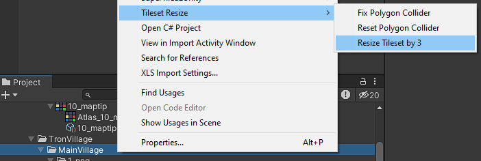

After that please check all the collider in scene
There's might be a case that the polygon collider being shifted down a little bit 
If you found 1 polygon collider has this issue, select this option to fix it

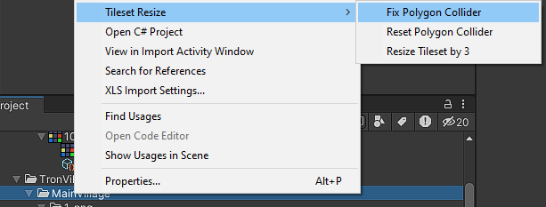

If there's 1 polygon correct then all the polygon is correct and you dont have to fix it
If you accidently fix the collider, you can reset by select this

If there're many scene using the same tilemap, you should open those scene to check whether the collider is correct and fix it

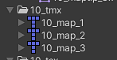

This is the result, please smoke test after resize

Further optimize:

You can change the atlas size to fit with new size
For example the size is 704x992 now so you only need atlas with 1024x1024 size to contains all of it 

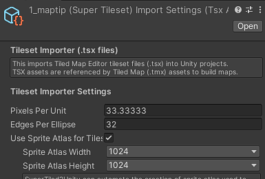

Problems left:

Tilemap PPU not match, but I don't see any issue cause by this

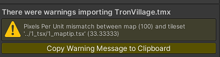

# Warning
#### Some tilemap after reducing by tool will get an error like this
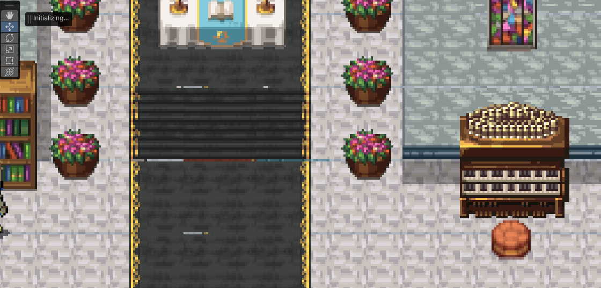

### Reason and how to fix it
- There are some files that have a rate of 300% but there is an excess paragraph below
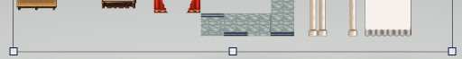

- So we need to crop the excess by cropping that part so that the height and the width are divisible by 3.
Example: (Height: 4000px to 3936px)
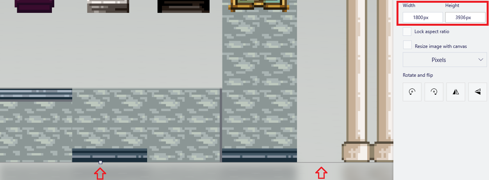
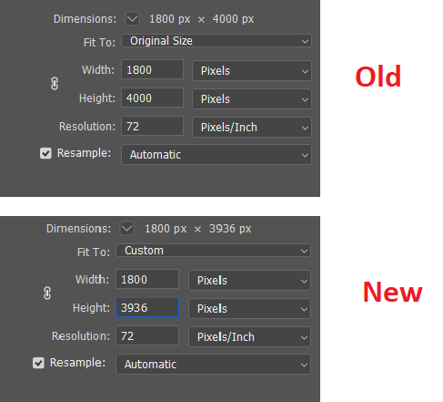

- After resizing the tilemap, we need to open the file TSX of the tilemap and edit with text editor to change the height and width same as the tilemap after resizing.

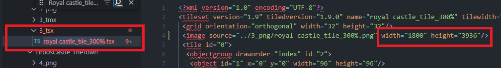

- After that, we need back to Unity for Unity to re-import the change of the tilemap (If we don't do that Unity can be error texture and we need to reset Unity) and reduce the tilemap by tools again

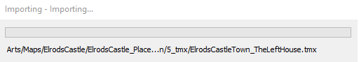